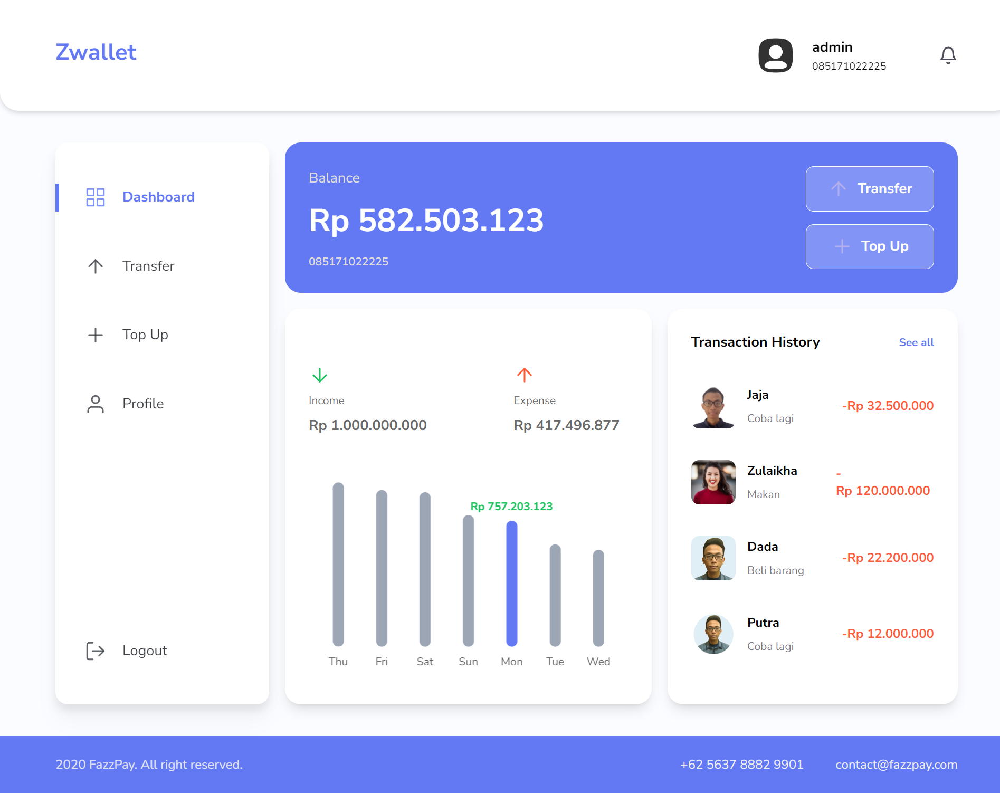

## 📝 About The Project

 <p>
   <ul>
     <li><strong>ZWallet</strong> is a digital wallet to transfer money online and solve your banking problem.</li>
   </ul>
 </p>
 
 </p>

## 🛠️ Installation Steps

1. Clone the repository

```bash
git clone https://github.com/oktaviandwip/zwallet-frontend/
```

2. Install dependencies

```bash
npm install
# or
yarn install
```

3. run prettier

```bash
npm run format
# or
yarn format
```

4. Run the app

```bash
npm run dev
# or
yarn dev
```

🌟 You are all set!

## 💻 Built with

- [![React][React.js]][React-url]
- [![Tailwind][Tailwind-CSS]][Tailwind-url]
- [![Redux][Redux]][Redux-url]

<hr>

## 👨‍💻 Team Members

| **Full-Stack Developer & Team Leader** | **Full-Stack Developer** | **Full-Stack Developer** | **Full-Stack Developer** |
|:--------------------------------------:|:------------------------:|:------------------------:|:------------------------:|
| [](https://github.com/guslizikri) | [](https://github.com/oktaviandwip) | [](https://github.com/Roisfaozi) | [](https://github.com/taufikharahap) |
| [Zikri Gusli](https://github.com/guslizikri) | [Oktavian Dwi Putra](https://github.com/oktaviandwip) | [Rois Faozi](https://github.com/Roisfaozi) | [Taufik Harahap](https://github.com/taufikharahap) |

<br/>

## 🎨 UI/UX



<hr>
<p align="center">
Developed with ❤️ in Indonesia 	🇮🇩
</p>

<!-- MARKDOWN LINKS & IMAGES -->
<!-- https://www.markdownguide.org/basic-syntax/#reference-style-links -->

[React.js]: https://img.shields.io/badge/React-20232A?style=for-the-badge&logo=react&logoColor=61DAFB
[React-url]: https://reactjs.org/
[Tailwind-CSS]: https://img.shields.io/badge/tailwindcss-%2338B2AC.svg?style=for-the-badge&logo=tailwind-css&logoColor=white
[Tailwind-url]: https://tailwindcss.com/
[Redux]: https://img.shields.io/badge/redux-%23593d88.svg?style=for-the-badge&logo=redux&logoColor=white
[Redux-url]: https://redux.js.org/
